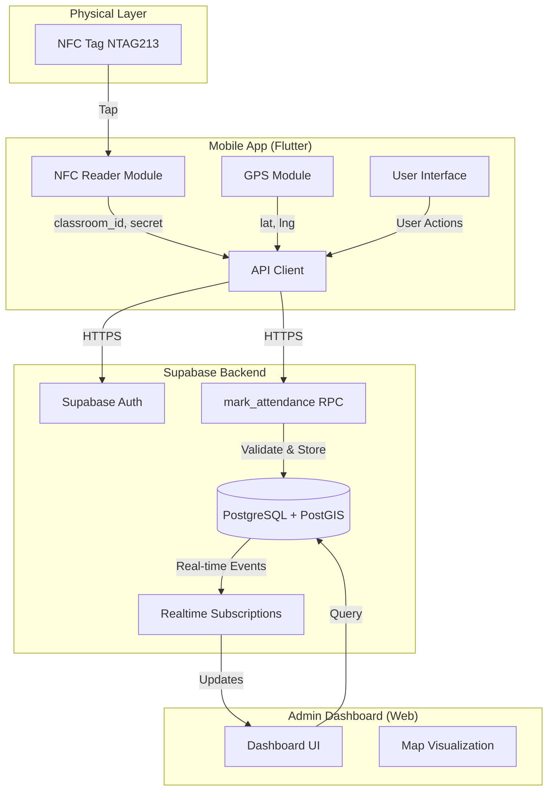
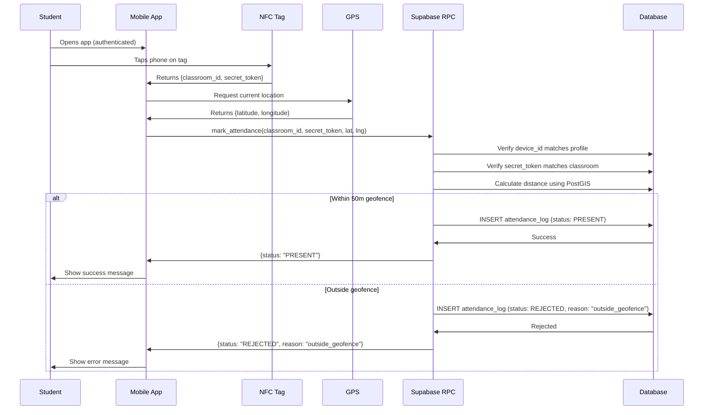

# Design Document: Smart NFC Attendance System (SNAS)

## Overview

The Smart NFC Attendance System is a distributed mobile application consisting of three main layers:

1. **Mobile Application Layer** (Flutter): Cross-platform mobile app handling NFC scanning, GPS capture, and user interface
2. **Backend Layer** (Supabase): Authentication, database, and business logic via RPC functions
3. **Admin Dashboard Layer** (Web): Real-time monitoring interface with map visualization

The system enforces attendance integrity through multiple validation layers: device binding prevents account sharing, NFC secret tokens prevent tag cloning, GPS geofencing prevents remote check-ins, and server-side validation prevents client-side tampering.

**Key Design Principles:**
- Security-first: All validation happens server-side
- Performance: Sub-200ms validation response time
- Simplicity: Minimal user interaction (tap and done)
- Auditability: Complete logging of all attempts

## Architecture

### System Architecture Diagram



### Data Flow: Attendance Marking



## Components and Interfaces

### 1. Mobile Application (Flutter)

#### 1.1 Authentication Module

**Responsibilities:**
- Handle user login via Supabase Auth
- Manage session tokens
- Enforce device binding

**Key Functions:**
```dart
Future<AuthResult> signInWithEmail(String email, String password)
Future<void> signOut()
Future<bool> isDeviceBound()
String getDeviceId()
```

**Implementation Notes:**
- Use `device_info_plus` package to get unique device identifier
- Store device_id on first login
- Check device_id on subsequent logins

#### 1.2 NFC Scanner Module

**Responsibilities:**
- Read NFC tags when tapped
- Parse NDEF messages
- Extract JSON payload

**Key Functions:**
```dart
Future<void> startNFCSession()
Future<NFCPayload> readTag()
void stopNFCSession()
```

**NFCPayload Structure:**
```dart
class NFCPayload {
  final String classroomId;
  final String secretToken;
}
```

**Implementation Notes:**
- Use `nfc_manager` package for cross-platform NFC support
- Handle platform-specific permissions (Android: NFC permission, iOS: NFC capability)
- Parse NDEF text records containing JSON

#### 1.3 GPS Module

**Responsibilities:**
- Capture current device location
- Request location permissions
- Handle location errors

**Key Functions:**
```dart
Future<LocationData> getCurrentLocation()
Future<bool> isLocationEnabled()
Future<bool> requestLocationPermission()
```

**LocationData Structure:**
```dart
class LocationData {
  final double latitude;
  final double longitude;
  final double accuracy;
}
```

**Implementation Notes:**
- Use `geolocator` package for location services
- Request high accuracy mode
- Timeout after 10 seconds if location unavailable

#### 1.4 API Client Module

**Responsibilities:**
- Communicate with Supabase backend
- Handle authentication headers
- Manage error responses

**Key Functions:**
```dart
Future<AttendanceResult> markAttendance(
  String classroomId,
  String secretToken,
  double latitude,
  double longitude
)
Future<List<AttendanceLog>> getMyAttendance()
```

**AttendanceResult Structure:**
```dart
class AttendanceResult {
  final String status; // "PRESENT" or "REJECTED"
  final String? rejectionReason;
  final DateTime timestamp;
}
```

#### 1.5 UI Module

**Screens:**

1. **Login Screen**
   - Email and password fields
   - Sign in button
   - Error message display

2. **Home Screen (NFC Ready)**
   - Large "Tap to Scan" indicator
   - NFC ready status
   - Recent attendance list
   - Logout button

3. **Scanning Screen**
   - Loading indicator
   - "Processing..." message

4. **Result Screen**
   - Success: Green checkmark, "Attendance Marked!"
   - Failure: Red X, rejection reason
   - Return to home button

5. **History Screen**
   - List of past attendance records
   - Date, classroom, status
   - Filter options

### 2. Backend (Supabase)

#### 2.1 Database Schema

**profiles table:**
```sql
CREATE TABLE profiles (
  id UUID PRIMARY KEY REFERENCES auth.users(id),
  email TEXT NOT NULL UNIQUE,
  full_name TEXT NOT NULL,
  device_id TEXT UNIQUE,
  created_at TIMESTAMPTZ DEFAULT NOW()
);
```

**classrooms table:**
```sql
CREATE TABLE classrooms (
  id UUID PRIMARY KEY DEFAULT gen_random_uuid(),
  name TEXT NOT NULL,
  building TEXT NOT NULL,
  location GEOGRAPHY(POINT, 4326) NOT NULL,
  nfc_secret TEXT NOT NULL UNIQUE,
  created_at TIMESTAMPTZ DEFAULT NOW()
);
```

**attendance_logs table:**
```sql
CREATE TABLE attendance_logs (
  id UUID PRIMARY KEY DEFAULT gen_random_uuid(),
  student_id UUID NOT NULL REFERENCES profiles(id),
  classroom_id UUID NOT NULL REFERENCES classrooms(id),
  timestamp TIMESTAMPTZ DEFAULT NOW(),
  status TEXT NOT NULL CHECK (status IN ('PRESENT', 'REJECTED')),
  student_location GEOGRAPHY(POINT, 4326) NOT NULL,
  rejection_reason TEXT,
  CONSTRAINT valid_rejection CHECK (
    (status = 'REJECTED' AND rejection_reason IS NOT NULL) OR
    (status = 'PRESENT' AND rejection_reason IS NULL)
  )
);

CREATE INDEX idx_attendance_student ON attendance_logs(student_id, timestamp DESC);
CREATE INDEX idx_attendance_classroom ON attendance_logs(classroom_id, timestamp DESC);
CREATE INDEX idx_attendance_timestamp ON attendance_logs(timestamp DESC);
```

#### 2.2 RPC Function: mark_attendance

**Function Signature:**
```sql
CREATE OR REPLACE FUNCTION mark_attendance(
  p_classroom_id UUID,
  p_secret_token TEXT,
  p_latitude DOUBLE PRECISION,
  p_longitude DOUBLE PRECISION
)
RETURNS JSON
LANGUAGE plpgsql
SECURITY DEFINER
AS $$
```

**Validation Logic:**

1. **Device Binding Check:**
   - Get current user's device_id from profiles
   - Compare with device_id from JWT claims
   - Reject if mismatch

2. **Secret Token Validation:**
   - Query classrooms table for p_classroom_id
   - Compare p_secret_token with stored nfc_secret
   - Reject if mismatch

3. **Geofence Validation:**
   - Create point from p_latitude, p_longitude
   - Calculate distance to classroom location using ST_Distance
   - Reject if distance > 50 meters

4. **Attendance Logging:**
   - Insert record into attendance_logs
   - Set status based on validation results
   - Return result JSON

**Return Format:**
```json
{
  "status": "PRESENT" | "REJECTED",
  "rejection_reason": null | "invalid_token" | "device_mismatch" | "outside_geofence",
  "timestamp": "2024-01-15T10:30:00Z"
}
```

**Performance Optimization:**
- Use spatial index on classrooms.location
- Single transaction for all operations
- Minimize database round trips

#### 2.3 Row Level Security Policies

**profiles table:**
```sql
ALTER TABLE profiles ENABLE ROW LEVEL SECURITY;

-- Students can only read their own profile
CREATE POLICY "Users can view own profile"
  ON profiles FOR SELECT
  USING (auth.uid() = id);

-- Students can update their own profile (except device_id)
CREATE POLICY "Users can update own profile"
  ON profiles FOR UPDATE
  USING (auth.uid() = id);
```

**attendance_logs table:**
```sql
ALTER TABLE attendance_logs ENABLE ROW LEVEL SECURITY;

-- Students can only read their own attendance
CREATE POLICY "Users can view own attendance"
  ON attendance_logs FOR SELECT
  USING (auth.uid() = student_id);

-- Only RPC function can insert (SECURITY DEFINER)
CREATE POLICY "Only system can insert attendance"
  ON attendance_logs FOR INSERT
  WITH CHECK (false);
```

**classrooms table:**
```sql
ALTER TABLE classrooms ENABLE ROW LEVEL SECURITY;

-- Everyone can read classroom info (except secret)
CREATE POLICY "Anyone can view classrooms"
  ON classrooms FOR SELECT
  USING (true);
```

### 3. Admin Dashboard (Web)

#### 3.1 Dashboard Components

**Real-time Attendance Feed:**
- Subscribe to attendance_logs table changes
- Display recent check-ins with student name, classroom, timestamp
- Color-coded by status (green for PRESENT, red for REJECTED)

**Map Visualization:**
- Display classroom locations as markers
- Show recent student check-in points
- Draw 50m radius circles around classrooms
- Use Leaflet or Mapbox for mapping

**Filters and Analytics:**
- Date range selector
- Classroom filter
- Status filter (PRESENT/REJECTED/ALL)
- Summary statistics (total attendance, rejection rate)

#### 3.2 Data Queries

**Get Recent Attendance:**
```sql
SELECT 
  al.id,
  al.timestamp,
  al.status,
  al.rejection_reason,
  p.full_name as student_name,
  c.name as classroom_name,
  c.building,
  ST_X(al.student_location::geometry) as student_lng,
  ST_Y(al.student_location::geometry) as student_lat,
  ST_X(c.location::geometry) as classroom_lng,
  ST_Y(c.location::geometry) as classroom_lat
FROM attendance_logs al
JOIN profiles p ON al.student_id = p.id
JOIN classrooms c ON al.classroom_id = c.id
WHERE al.timestamp >= NOW() - INTERVAL '24 hours'
ORDER BY al.timestamp DESC
LIMIT 100;
```

## Data Models

### Profile Model

```typescript
interface Profile {
  id: string;              // UUID
  email: string;           // University email
  full_name: string;       // Student full name
  device_id: string | null; // Bound device identifier
  created_at: string;      // ISO timestamp
}
```

**Invariants:**
- email must be unique
- device_id must be unique if not null
- id references auth.users

### Classroom Model

```typescript
interface Classroom {
  id: string;              // UUID
  name: string;            // e.g., "Room 301"
  building: string;        // e.g., "Engineering Building"
  location: {              // PostGIS geography
    latitude: number;
    longitude: number;
  };
  nfc_secret: string;      // Secret token for validation
  created_at: string;      // ISO timestamp
}
```

**Invariants:**
- nfc_secret must be unique
- location must be valid WGS84 coordinates
- latitude: -90 to 90, longitude: -180 to 180

### AttendanceLog Model

```typescript
interface AttendanceLog {
  id: string;              // UUID
  student_id: string;      // References profiles.id
  classroom_id: string;    // References classrooms.id
  timestamp: string;       // ISO timestamp
  status: 'PRESENT' | 'REJECTED';
  student_location: {      // PostGIS geography
    latitude: number;
    longitude: number;
  };
  rejection_reason: string | null; // Required if REJECTED
}
```

**Invariants:**
- If status is REJECTED, rejection_reason must not be null
- If status is PRESENT, rejection_reason must be null
- student_id must reference valid profile
- classroom_id must reference valid classroom

### NFC Tag Payload Model

```typescript
interface NFCTagPayload {
  classroom_id: string;    // UUID of classroom
  secret_token: string;    // Secret for validation
}
```

**Storage Format (NDEF):**
```json
{
  "classroom_id": "550e8400-e29b-41d4-a716-446655440000",
  "secret_token": "a1b2c3d4e5f6g7h8i9j0"
}
```

**Tag Configuration:**
- Type: NTAG213 (144 bytes usable memory)
- NDEF message with single text record
- JSON payload approximately 100 bytes
- Read-only after programming (optional)


## Correctness Properties

*A property is a characteristic or behavior that should hold true across all valid executions of a system—essentially, a formal statement about what the system should do. Properties serve as the bridge between human-readable specifications and machine-verifiable correctness guarantees.*

### Property 1: Authentication Success Creates Profile

*For any* valid university email and password combination, when authentication succeeds, querying the profiles table should return a profile record with matching email.

**Validates: Requirements 1.1, 1.2**

### Property 2: Authentication Failure Prevents Access

*For any* invalid credentials (wrong password, non-existent email, malformed email), authentication should fail and return an appropriate error code.

**Validates: Requirements 1.3**

### Property 3: Email Verification Required for Attendance

*For any* user account with unverified email, attempting to mark attendance should be rejected with reason "email_not_verified".

**Validates: Requirements 1.4**

### Property 4: First Login Binds Device

*For any* new profile without device_id, when a user logs in from a device, the profile's device_id field should be set to that device's identifier.

**Validates: Requirements 2.1, 2.3**

### Property 5: Device Binding Enforcement

*For any* profile with existing device_id, attempting to authenticate from a different device_id should fail and the original device_id should remain unchanged.

**Validates: Requirements 2.2**

### Property 6: JSON Payload Parsing

*For any* valid JSON string containing classroom_id and secret_token fields, parsing should succeed and extract both values correctly.

**Validates: Requirements 3.2**

### Property 7: Malformed Payload Rejection

*For any* invalid JSON or JSON missing required fields (classroom_id or secret_token), parsing should fail and return an error.

**Validates: Requirements 3.3**

### Property 8: GPS Unavailable Error Handling

*For any* attendance attempt when GPS is disabled or unavailable, the mobile app should prevent the attendance submission and display an error message.

**Validates: Requirements 4.3**

### Property 9: Coordinates Transmitted to Backend

*For any* attendance marking request, the API call should include latitude and longitude parameters.

**Validates: Requirements 4.4**

### Property 10: Secret Token Validation

*For any* classroom and provided secret_token, validation should succeed if and only if the token matches the classroom's stored nfc_secret.

**Validates: Requirements 5.2**

### Property 11: Device ID Verification

*For any* attendance marking attempt, validation should succeed only if the requesting user's device_id matches their profile's stored device_id.

**Validates: Requirements 5.3**

### Property 12: Distance Calculation Accuracy

*For any* two geographic points (student location and classroom location), the calculated distance using PostGIS ST_Distance should be within 1 meter of the true geodesic distance.

**Validates: Requirements 5.4**

### Property 13: RPC Performance Requirement

*For any* valid attendance marking request, the mark_attendance RPC function should complete execution within 200 milliseconds.

**Validates: Requirements 5.5**

### Property 14: Validation Failure Returns Rejection

*For any* attendance marking attempt that fails validation (invalid token, device mismatch, or outside geofence), the response should have status "REJECTED" and include a non-null rejection_reason.

**Validates: Requirements 5.6**

### Property 15: Geofence Boundary Enforcement

*For any* attendance marking attempt:
- If student location is more than 50 meters from classroom location, status should be "REJECTED" with reason "outside_geofence"
- If student location is within 50 meters and all other validations pass, status should be "PRESENT"

**Validates: Requirements 6.2, 6.3**

### Property 16: All Attempts Logged

*For any* attendance marking attempt (successful or rejected), a record should be created in the attendance_logs table with matching student_id, classroom_id, and timestamp.

**Validates: Requirements 7.1**

### Property 17: Attendance Log Data Model Invariants

*For any* attendance log record:
- It must contain student_id, classroom_id, timestamp, status, and student_location
- If status is "REJECTED", rejection_reason must not be null
- If status is "PRESENT", rejection_reason must be null

**Validates: Requirements 7.2, 7.3**

### Property 18: Attendance Log Immutability

*For any* attendance log record after creation, attempts to update any field should fail (logs are append-only).

**Validates: Requirements 7.4**

### Property 19: Dashboard Query Completeness

*For any* attendance log record, the admin dashboard query should return all required fields: student name, classroom name, building, timestamp, status, and coordinates.

**Validates: Requirements 8.2**

### Property 20: Dashboard Filtering

*For any* filter criteria (date range, classroom_id, or status):
- All returned records should match the filter criteria
- No records matching the criteria should be excluded

**Validates: Requirements 8.5**

### Property 21: Foreign Key Integrity

*For any* attempt to create an attendance log with non-existent student_id or classroom_id, the database should reject the insertion with a foreign key constraint violation.

**Validates: Requirements 9.5**

### Property 22: Row Level Security for Students

*For any* student user:
- Querying profiles should return only their own profile
- Querying attendance_logs should return only their own attendance records
- Attempting to access other students' data should return empty results

**Validates: Requirements 10.2, 10.3**

### Property 23: NFC Payload Structure Validation

*For any* NFC tag payload, it must be valid JSON containing both classroom_id (UUID format) and secret_token (non-empty string) fields.

**Validates: Requirements 11.3**

### Property 24: Secret Token Uniqueness

*For any* two different classrooms, their nfc_secret values must be different. Attempting to create a classroom with a duplicate nfc_secret should fail with a uniqueness constraint violation.

**Validates: Requirements 11.4**

### Property 25: Attendance History Retrieval

*For any* student, querying their attendance history should return all their attendance log records ordered by timestamp descending.

**Validates: Requirements 12.4**

### Property 26: Concurrent Request Handling

*For any* set of concurrent attendance marking requests from different students, all valid requests should succeed and create separate log records without data corruption or race conditions.

**Validates: Requirements 13.3**

### Property 27: Input Parameter Validation

*For any* mark_attendance RPC call with invalid parameters (null values, wrong types, invalid UUIDs, out-of-range coordinates), the function should reject the request with an appropriate error before attempting validation.

**Validates: Requirements 14.2**

## Error Handling

### Error Categories

**1. Authentication Errors:**
- Invalid credentials → Return 401 with message "Invalid email or password"
- Email not verified → Return 403 with message "Email verification required"
- Device mismatch → Return 403 with message "This account is bound to another device"

**2. NFC Reading Errors:**
- Tag unreadable → Display "Unable to read NFC tag. Please try again."
- Malformed payload → Display "Invalid NFC tag. Please contact administrator."
- Missing fields → Display "Incomplete tag data. Please contact administrator."

**3. GPS Errors:**
- GPS disabled → Display "Please enable location services to mark attendance."
- GPS timeout → Display "Unable to determine location. Please try again."
- Low accuracy → Display "Location accuracy too low. Please move to an open area."

**4. Validation Errors:**
- Invalid token → Return {status: "REJECTED", reason: "invalid_token"}
- Device mismatch → Return {status: "REJECTED", reason: "device_mismatch"}
- Outside geofence → Return {status: "REJECTED", reason: "outside_geofence"}
- Email not verified → Return {status: "REJECTED", reason: "email_not_verified"}

**5. Database Errors:**
- Connection failure → Retry with exponential backoff (3 attempts)
- Constraint violation → Return appropriate error message
- Timeout → Return "Request timeout. Please try again."

**6. Network Errors:**
- No internet connection → Display "No internet connection. Please check your network."
- Request timeout → Display "Request timed out. Please try again."
- Server error (5xx) → Display "Server error. Please try again later."

### Error Recovery Strategies

**Mobile App:**
- Implement retry logic with exponential backoff for transient failures
- Cache failed requests for retry when connection restored (optional)
- Provide clear user feedback for all error conditions
- Log errors locally for debugging

**Backend:**
- Use database transactions to ensure atomicity
- Implement request idempotency to prevent duplicate logs
- Log all errors with context for debugging
- Return structured error responses with error codes

## Testing Strategy

### Dual Testing Approach

The SNAS will employ both unit testing and property-based testing to ensure comprehensive coverage:

**Unit Tests** focus on:
- Specific examples demonstrating correct behavior
- Edge cases (empty strings, boundary values, null handling)
- Error conditions and exception handling
- Integration points between components

**Property-Based Tests** focus on:
- Universal properties that hold for all inputs
- Comprehensive input coverage through randomization
- Invariant validation across many scenarios
- Round-trip properties (serialization/deserialization)

Both testing approaches are complementary and necessary. Unit tests catch concrete bugs in specific scenarios, while property tests verify general correctness across a wide input space.

### Property-Based Testing Configuration

**Framework Selection:**
- **Flutter/Dart**: Use `test` package with custom property test helpers or `faker` for data generation
- **PostgreSQL/SQL**: Use pgTAP for database testing
- **TypeScript (Dashboard)**: Use `fast-check` library

**Test Configuration:**
- Minimum 100 iterations per property test (due to randomization)
- Each property test must reference its design document property
- Tag format: `// Feature: smart-nfc-attendance-system, Property {number}: {property_text}`

**Example Property Test Structure:**

```dart
// Feature: smart-nfc-attendance-system, Property 6: JSON Payload Parsing
test('Property 6: Valid JSON with required fields parses correctly', () {
  final random = Random();
  for (int i = 0; i < 100; i++) {
    // Generate random valid payload
    final classroomId = Uuid().v4();
    final secretToken = generateRandomString(20);
    final json = '{"classroom_id": "$classroomId", "secret_token": "$secretToken"}';
    
    // Parse and verify
    final payload = NFCPayload.fromJson(json);
    expect(payload.classroomId, equals(classroomId));
    expect(payload.secretToken, equals(secretToken));
  }
});
```

### Test Coverage by Component

**Mobile App (Flutter):**

*Unit Tests:*
- Authentication flow with valid/invalid credentials
- NFC payload parsing with various JSON formats
- GPS error handling when location unavailable
- API client error handling for network failures
- UI state transitions for success/error cases

*Property Tests:*
- Property 6: JSON payload parsing for all valid inputs
- Property 7: Malformed payload rejection for all invalid inputs
- Property 9: Coordinates included in all API requests
- Property 25: Attendance history retrieval returns correct records

**Backend (Supabase/PostgreSQL):**

*Unit Tests:*
- mark_attendance RPC with specific valid/invalid scenarios
- Database constraint enforcement (foreign keys, unique constraints)
- RLS policy enforcement for specific users
- Token rotation functionality

*Property Tests:*
- Property 1: Authentication creates profile for all valid credentials
- Property 4: First login binds device for all new profiles
- Property 5: Device binding prevents login from different devices
- Property 10: Secret token validation for all token/classroom pairs
- Property 11: Device ID verification for all users
- Property 12: Distance calculation accuracy for all coordinate pairs
- Property 13: RPC performance under 200ms for all valid requests
- Property 14: Validation failures return rejection for all invalid inputs
- Property 15: Geofence enforcement for all location/classroom pairs
- Property 16: All attempts logged regardless of outcome
- Property 17: Log data model invariants hold for all records
- Property 18: Logs are immutable after creation
- Property 21: Foreign key integrity enforced for all invalid references
- Property 22: RLS isolates student data for all queries
- Property 24: Secret token uniqueness enforced
- Property 26: Concurrent requests handled correctly
- Property 27: Input validation rejects all invalid parameters

**Admin Dashboard:**

*Unit Tests:*
- Dashboard query with specific filters
- Map rendering with sample data
- Real-time subscription handling

*Property Tests:*
- Property 19: Dashboard query returns complete data for all records
- Property 20: Filtering returns correct results for all filter criteria

### Integration Testing

**End-to-End Scenarios:**
1. Complete attendance flow: Login → Scan NFC → Mark attendance → Verify in dashboard
2. Rejection scenarios: Outside geofence, invalid token, wrong device
3. Device binding flow: First login → Bind device → Attempt from second device
4. Admin monitoring: Mark attendance → Verify real-time update in dashboard

**Performance Testing:**
- Load test: 100 concurrent attendance marking requests
- Measure RPC execution time under load
- Verify database query performance with large datasets

**Security Testing:**
- Attempt to bypass device binding
- Attempt to mark attendance with invalid tokens
- Attempt to access other students' data
- Verify RLS policies prevent unauthorized access

### Test Data Generation

**For Property Tests:**
- Generate random UUIDs for IDs
- Generate random coordinates within valid ranges (-90 to 90 lat, -180 to 180 lng)
- Generate random strings for tokens and names
- Generate random timestamps within reasonable ranges
- Generate random valid/invalid JSON payloads

**For Unit Tests:**
- Use fixed test data for reproducibility
- Include edge cases: empty strings, null values, boundary values
- Include realistic examples from actual use cases

### Continuous Integration

**CI Pipeline:**
1. Run all unit tests on every commit
2. Run property tests (100 iterations each) on every commit
3. Run integration tests on pull requests
4. Measure and report test coverage
5. Fail build if any test fails or coverage drops below threshold

**Coverage Goals:**
- Unit test coverage: >80% of code
- Property test coverage: All 27 properties implemented
- Integration test coverage: All critical user flows
